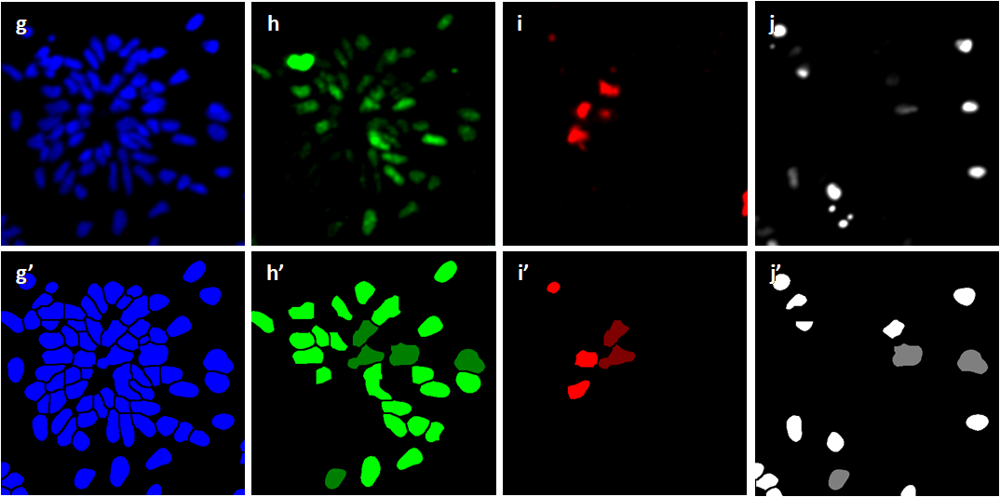

# ImageJ Plugin Auto Cell Counter

Plugin Auto Cell Counter was written to do cell counting for retinal organoids imaged by confocal microscope, and it is based on the segmentation of the cells in the image set. 

**Principle:**

The cells in a retinal organoid often form clamps (a), thresholding followed by doing watershed does not segment the cells. However the cells can be separated by checking their peaks. First the image is smoothed (b) using a Gaussian filter, and the peaks of the cells as shown in the surface plot (c) are picked in (d). A peak is picked if its prominence is above the set prominence. Choosing the right filter and prominence parameters plugin Auto Cell Counter can pick one peak for almost all the cells.       

Peaks in the background (arrow pointed in (d)) may also be detected. The cell and background peaks are differentiated by thresholding (e). Segmented cells are shown in (f).

**Parameters:**

Start plugin Auto Cell Counter, it asks to load a microscope image set,  smoothes the images, and picks the peaks using the default Gaussian filter radius and prominence values 3 and 6, and the thresholds auto-detected. The plugin allows tweaking the smoothing, cell peak picking and background suppressing by modifying the filter radius, prominence and threshold values and using buttons "Smooth", "View Peaks" and "Update". Button "Reset" resets the thresholds to auto-detected values. Button "Image Set" loads and analyzes another image set. The plugin can also do "Batch" cell counting, the counting will carry on all the image sets in the parent folder of the current image set with the option to "Hold" the current filter radius, prominence and threshold values. 

**Example:**

Here is an example of cell counting by plugin Auto Cell Counter. The image set of retinal organoids include 4 channels of blue, green, red and white that measure all the cells (g), cell proliferation (h), cell death (i) and grown ganglion cells (j) respectively, and below are the segmented images (g’, h’, i’ and j’). The plugin also counts the cells in each channel (Blue, Green, Red and White) and the cells co-localized in channels of green, red and white (GR, RW, GW and GRW), which are colored in darker green, red and white in the segmented images. 
